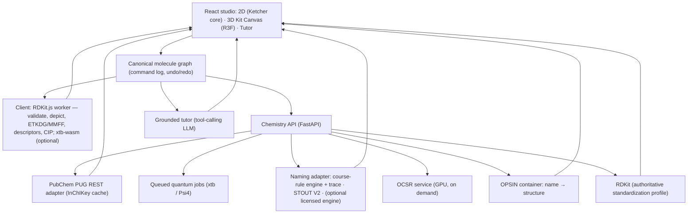

# Orbital — Final Product & Technical Specification

**A free, web-first molecular modelling studio and organic-chemistry naming tutor.**

*Merged final version. Consolidates two independent specs: one research-heavy (competitor teardown, licensing, accuracy evidence, spectacle features) and one engineering-heavy (interaction model, provenance contract, naming trace, grading, budgets, edge states). Where they disagreed, the resolution is stated inline.*

---

## 0. TL;DR

- **What it is:** a browser-native studio where a student can **type, draw, scan, or directly assemble** a molecule, manipulate it in true 3D, see its geometry and stereochemistry, and move reliably **in both directions between structure and IUPAC name** — with every naming decision explained visually on the molecule itself.
- **What makes it spectacular:** not a chatbot, not a viewer. The defining interaction is **clicking a word in the name and watching the exact atoms it describes light up** — and the reverse. Deterministic chemistry computes; AI explains.
- **The hard problem and its answer:** name→structure is solved and free (OPSIN: 99.8%+ precision, 98.7–99.2% recall). Structure→name has *no free rule-based engine*. Solution: a tiered pipeline — course-scope rule engine with a structured trace → PubChem exact match → STOUT-V2 candidate → mandatory OPSIN round-trip verification — with six honest provenance labels so the tool never bluffs.
- **The competitive gap:** ChemDoodle paywalls naming and is GPL; MolView is unmaintained and "wrong sometimes"; ChemDraw is desktop, subscription-only since Jan 2025; Ketcher/Mol*/3Dmol.js don't name or teach. Nobody combines a beautiful builder + trustworthy two-way naming + explainable derivations + a grounded tutor. That combination is the whole product.
- **Non-negotiables:** chemistry correctness outranks spectacle; the molecular graph is the single source of truth; never silently "fix" a molecule; never present an unverified name as authoritative; never hide ambiguity; first success without an account.

---

## 1. Vision & Product Principles

### North-star experience

She opens Orbital on her phone between classes. Types "2-methylbutan-2-ol." It snaps into 3D. She spins it, taps two bonds and sees 109.5°, rotates the C2–C3 bond and watches a Newman projection and an energy curve move live. She hits AR and the molecule stands on her desk. Then she draws her problem-set molecule, gets the correct name with a green *Verified* badge, taps "Explain," and watches the parent chain glow, numbering animate in both directions, and the app show her exactly why one end wins. She asks "why not the seven-carbon path?" and gets a visual comparison, not a paragraph. She screenshots it. Three friends sign up that night.

### Executive decision

Do not build "another molecule viewer." Build a **visual reasoning environment for organic chemistry** with four tightly synchronized surfaces:

1. **Build** — assemble directly in 3D with valence-aware connection ports, or draw conventionally in 2D.
2. **Name** — name→structure and structure→verified name.
3. **Understand** — bond angles, hybridization, charge, stereochemistry, parent-chain selection, numbering and naming logic shown *on the molecule*.
4. **Practice** — any molecule becomes a problem with a hint ladder and structure-based grading.

### Non-negotiable principles

- Chemistry correctness outranks visual spectacle.
- Spectacle comes from clarity, material quality, motion and immediacy — not decoration.
- The molecular graph is the source of truth; 2D and 3D are synchronized views of it.
- Never silently "fix" a molecule. Explain what is invalid and offer a one-tap repair.
- Never present an AI-generated name as authoritative without deterministic verification.
- Never hide ambiguity: tautomers, protonation, unspecified stereo, multiple accepted names, conformers are all visible states.
- The first successful interaction happens without an account, a tutorial video, or prior chemistry-software knowledge.
- Free to use. Everything shipped in the bundle is permissively licensed.

---

## 2. Background — What a Model Kit Is, and What We Must Surpass

Physical kits (Molymod, Orbit, Darling, Prentice-Hall, Indigo, Dalton) represent atoms as color-coded pieces with a fixed number of connection holes and bonds as connectors. A typical student set is ~50 atoms / ~38 bonds, ~2.5 cm = 1 Å, standard CPK colors (C black, N blue, O red, H white, halogens green/brown/purple). Students use them to make abstract 3D concepts tangible:

- which atoms connect, typical valence and bond order;
- **VSEPR geometry and bond angles** (linear → tetrahedral → octahedral);
- **rotation about single bonds** — Newman projections, staggered/eclipsed, gauche/anti;
- **ring shapes and strain** — cyclohexane chair/boat, ring flips, axial/equatorial;
- **stereochemistry** — R/S, enantiomers as mirror images, cis/trans, meso;
- how a flat skeletal drawing corresponds to a 3D object.

Their limits: idealized plastic angles that can't relax to real minima; no angle readout; no energies; no naming; no validation; no search; no saved state; lost pieces; cost.

**Two models the digital version must hold at once:**

1. A **chemical graph** (atoms = nodes, typed bonds = edges) — this determines *identity*.
2. One or more **3D conformers** (coordinates) — these determine *shape*, but a single conformer is not the molecule's identity.

This distinction drives both engineering and UI: dragging the camera never changes chemistry; rotating a single bond changes a conformer but not identity; adding or deleting a bond changes the graph and triggers revalidation and renaming.

**Must replicate:** the tactile "snap two things together" feeling; correct 3D geometry; rotate and inspect from any angle; distinct bond orders; lone pairs; ball-and-stick and space-filling.

**Must surpass:** live bond-angle/dihedral readouts; force-field and quantum-accurate geometries; animated conformational changes with live energy diagrams; automatic 2D↔3D; unlimited parts; instant stereo assignment; instant switching among Lewis / skeletal / ball-and-stick / space-filling / Newman / Fischer / chair; and — the additions no kit can offer — **two-way naming, explained naming, and a tutor that sees your molecule.**

---

## 3. Competitor Teardown

| Product | What it does well | Where it fails the student | What we do differently |
|---|---|---|---|
| **ChemDoodle Web / 2D / 3D** (iChemLabs) | Genuinely strong chemistry; best free-adjacent naming demo (name→structure is OPSIN-powered; own struct→name) | Web Components are **GPLv3** (can't embed in a non-GPL product without a commercial license); IUPAC demo throttles ("exceeded maximum free transactions"); unlimited naming requires a paid license (~$18–$29+); tool-centric, dated UI; returns an answer without making the reasoning spatial or teachable | Free; explainable naming; polished UX; no GPL code in our bundle |
| **MolView** | Beloved free 2D→3D with PubChem search, render modes, measurements | Original: "no plans for new features," "3D structure … is wrong sometimes" (its own blog); 2024 rewrite narrowed scope and put save/export/mechanisms behind $9–$49/yr tiers; not a nomenclature tutor; no *why* | Correct geometry; naming with provenance; teaching layer |
| **ChemDraw** (Revvity) | Professional gold standard; Struct=Name / Name>Struct excellent (>99% batch claim) | Desktop-first; **perpetual licenses discontinued Jan 1 2025**, subscription-only (~$25–$170+/mo); not mobile; not pedagogical | Web-first, free, mobile, pedagogical |
| **Marvin JS / MarvinSketch** (ChemAxon) | Excellent sketcher; commercial struct→name | Proprietary, license-gated; professional density | — |
| **Ketcher** (EPAM, Apache-2.0) | Polished React sketcher; stereo labels; broad formats; cleanup; OCR hook | No naming; no integrated 3D; no tutoring; 40-icon perimeter | We use it *as a substrate*, wrapped in a simplified student UI |
| **JSME / Kekule.js** | Lightweight, permissive | Visually dated / low-level | Reference only |
| **Mol\*** (MIT), **3Dmol.js** (BSD-3), NGL, JSmol | Mol\*: modern WebGL, SSAO, outlines, AR/VR, used by RCSB/PDBe. 3Dmol.js: fast embeddable viewer | Built for macromolecules; **viewers, not builders**; no naming; JSmol is a slow software renderer | Custom editable 3D "Kit Canvas"; Mol\*/3Dmol.js as secondary viewers |
| **Avogadro, Jmol, Chem3D, Spartan, Nanome** | Powerful editing / force fields / VR | Installed desktop apps; research breadth; dated UX; not web | — |
| **MoleculARweb / MolecularWebXR** (EPFL) | Proves free, install-free WebXR AR chemistry works on phones | Viewer/education demos, no builder, no naming | We adopt the AR pattern inside a full studio |
| **PubChem** | Enormous database, names, synonyms, properties | A database record, not a manipulation workspace | Our lookup backend, not our UI |
| **Physical kit** | Tactile, intuitive, spatial | No naming, validation, search, save, explanation | Everything above |

### What not to copy

- A perimeter of 40 unlabeled chemistry icons.
- A tiny viewer surrounded by forms and settings.
- A blank expert canvas as the first screen.
- "Invalid valence" as an unexplained toast.
- Returning one name as if nomenclature never has alternatives.
- Treating 3D as a modal export step after 2D drawing.
- A generic AI chat pane that describes the molecule without controlling or highlighting it.

---

## 4. Scope & Truth Contract

### Guaranteed instructional scope (release 1)

- Elements: H, C, N, O, F, P, S, Cl, Br, I (full periodic table available in the editor, labeled as outside verified scope for naming).
- Neutral molecules and common charged organic species (carbocations, carbanions, oxonium, ammonium, carboxylate, enolate).
- Single, double, triple, aromatic, wedge, dash, wavy bonds.
- Acyclic, monocyclic, and common polycyclic/fused/spiro/bridged systems from Orgo I/II.
- Functional groups: alkane, alkene, alkyne, haloalkane, alcohol, ether, epoxide, aldehyde, ketone, carboxylic acid and derivatives (ester, amide, acid halide, anhydride), amine, nitrile, thiol, sulfide, nitro, common aromatics and heteroaromatics.
- R/S, E/Z, enantiomers, diastereomers, meso, conformations, Newman/sawhorse/Fischer projections, cyclohexane chairs.
- Systematic and commonly accepted names within this syllabus.

### Visualize but do not overclaim

Coordination compounds, organometallics, polymers, mixtures, exotic valence states, and comprehensive biochemical nomenclature can be displayed where possible while naming/explanation says **"outside verified course scope."**

### Provenance labels (every name carries exactly one)

| Label | Meaning | Default answer? | Used to grade? |
|---|---|---|---|
| **Verified systematic** | Generated by the deterministic course-rule engine and round-trip checked (name → OPSIN → same InChIKey incl. stereo) | Yes | Yes |
| **Database name** | Exact InChIKey match in PubChem; its recorded IUPACName (Lexichem-generated) | Yes | Yes |
| **Accepted common name** | Synonym from a curated source (PubChem synonyms, ChEBI, course list) | Shown alongside | Yes if on course list |
| **Course convention** | Accepted under the instructor/course profile | Shown alongside | Yes |
| **Candidate, verified by structure** | ML-generated (STOUT) text that parses back through OPSIN to the exact same graph, including stereo | Yes, with amber badge | Yes |
| **Unverified candidate** | ML text that fails round-trip or cannot be checked | **Never** shown as default; shown only under an explicit "unverified" disclosure | **Never** |

Every 3D result likewise distinguishes **optimized model geometry** (method, force field, converged?) from experimental coordinates. Angles are reported as "model angle" and, when relevant, "idealized geometry" — not as experimental fact.

---

## 5. First-Run Experience

### Landing state

The page opens directly into the studio. No marketing page, no signup wall. Centered above a slowly rotating example molecule:

> **Build or find any molecule**
> Type a name, draw it, scan it, or start with an atom.

Four large actions: **Type a name · Build in 3D · Draw in 2D · Scan a structure.**
Example chips: `caffeine` · `(R)-2-butanol` · `3-ethyl-2-methylhexane` · `cyclohexane chair`.
The app quietly saves locally.

### The 30-second wow

If she chooses Build in 3D, the first action is embodied, not explained:

1. A carbon atom appears with four faint tetrahedral **connection ports**.
2. A single pulse and one line: "Drag from a port to add another atom."
3. The element palette opens under her finger/cursor.
4. The new atom snaps into an idealized direction; the molecule gently relaxes.
5. A small success card: "You built ethane. Carbon forms four bonds here; hidden hydrogens fill the rest."
6. The card offers "Name it" → *ethane*, Verified. And "See it on your desk" → AR.

Each advanced control teaches itself only when first encountered. A skippable 60-second tour covers place-atom, draw-bond, toggle-3D, name-it. Empty states teach ("Try typing *caffeine* or draw a hexagon").

---

## 6. Studio Information Architecture

### Desktop & tablet — three zones

1. **Element rail** (left): frequent atoms (C N O S P F Cl Br I H), bond tool, rings/fragments (benzene, cyclohexane, cyclopentane, common groups), full periodic table button.
2. **Molecule canvas** (center): 2D, 3D, or **Split** with a draggable divider.
3. **Context inspector** (right): changes with selection — atom, bond, angle, functional group, name token, or practice task. With nothing selected: the **Molecular facts card** (formula, molar mass, exact mass, formal charge, degree of unsaturation, functional groups, HBD/HBA, logP, TPSA, rotatable bonds, stereocenter count + unspecified stereo, canonical SMILES/InChI under an Advanced disclosure) and the live name with its provenance badge.

**Top bar:** molecule title · verified-name status · 2D / 3D / Split · undo/redo · universal command/search input (`⌘K` or `/`) · save/share/export/AR · Learn/Practice mode.
**Bottom of canvas:** only frequent contextual controls — bond order, add atom, hydrogens, labels, measure, center, relax.
**Status strip:** valence warnings and the "Explain name" trigger.

### Mobile

- Canvas stays full-screen; elements and bond types in a thumb-reachable bottom dock.
- Inspector is a three-height bottom sheet: peek / half / full.
- One-finger drag on empty space rotates; pinch zooms; two-finger drag pans.
- Tap atom selects; drag from a visible port builds a bond. Dragging an atom itself only in Conformer mode (prevents accidental distortion).
- 2D/3D toggle always visible. Long-press opens a radial context menu.
- **Apple Pencil / stylus** draws structures directly in 2D, feeding the OCSR cleanup path.
- Subtle haptics on snap, on the invalid-valence boundary, and on a completed practice step; every haptic has a visual equivalent.

### Selection & keyboard model (every pointer action has a keyboard equivalent)

| Action | Result |
|---|---|
| Click/tap atom · bond | Atom inspector · bond inspector |
| Shift-click / long-press | Multi-select; lasso in 2D |
| Click empty · drag empty | Clear selection · rotate view (3D) / pan (2D) |
| Drag a valence port | Create a bond (3D); in 2D, drag from atom grows a bond snapped to 120°/109.5°/180° |
| `C N O S P F H` (+ `Cl Br I` two-key) | Arm element; or replace element of selected atom |
| `1 2 3` | Set selected bond to single/double/triple |
| `R` | Ring templates |
| `W` / `D` | Wedge / dash on selected 2D bond |
| `Delete` | Remove with an undoable confirmation animation, not a modal |
| `Space` · `H` · `M` | Center & fit · toggle explicit H · measure mode |
| `⌘Z` / `⇧⌘Z` | Undo / redo (reverses the actual build animation) |
| `⌘K` or `/` | Command palette: "name this," "make it a chair," "flip stereocenter," "add water," "quiz me," "minimize," "show HOMO"… |

---

## 7. Direct 3D Building — The Signature Interaction

### Smart valence ports

When an atom is selected, faint connection ports appear in chemically plausible directions based on its current local environment: two opposite ports (sp-like), three coplanar (sp²-like), four tetrahedral (sp³-like), and geometry appropriate to common charged N/O/S states when explicitly chosen. Ports are teaching aids using typical organic-chemistry states by default; advanced charge/radical controls live in the inspector.

### Add flow

1. Drag from a port → a translucent bond stretches.
2. Hovering the element palette previews the atom and its implicit-H count.
3. Release to snap.
4. **Instant local placement** using idealized vector templates from the neighbor's geometry — rendered within one frame.
5. A **debounced background job** (RDKit ETKDGv3 + MMFF94 in a Web Worker) returns a relaxed geometry; the model morphs smoothly (300–450 ms, interruptible), moving only affected regions where possible.
6. Formula, name, validation and property cards update without layout shift; stale name/conformer requests are cancelled on the next edit.

### Invalid-action behavior (the requirement that "the software should know how many bonds per atom")

An impossible action never produces a generic error. The attempted bond pauses as a ghost at the boundary, the saturated atom gets a subtle red valence ring, and the inspector explains and teaches:

> Neutral carbon already has four bonds here — it has four valence electrons to share and no low-lying d orbitals, so a fifth bond isn't possible. Replace a bond, add the group to a neighbor, or remove an atom.

> Neutral oxygen already has its typical two bonds. Replace a bond, remove an atom, or explicitly make it O⁺ (an oxonium — here's what that means).

Offered actions are always chemically appropriate; the app never suggests a charge merely to force an arbitrary structure. Hypervalent S/P are permitted with an explanatory note. Undo history is preserved.

### Bond editing

- Tap a bond to select; bond-order control cycles only through states compatible with the graph (explicit choices in Advanced).
- Double/triple bonds render as separated cylinders that stay easy to select.
- Wedge/dash is set in 2D and reflected as 3D stereochemistry; drawing contradictory or ambiguous stereo shows a warning.
- Drag atom-to-atom to close a ring; ring strain previewed with a gentle amber indicator.

### Conformer mode (graph editing and shape manipulation are separate modes)

- Rotatable single bonds receive an arc handle; dragging changes the dihedral with a live readout.
- A live **Newman thumbnail** for the selected bond.
- A live **conformational energy curve** (MMFF single-point per step) labeled "relative force-field energy — lower/higher," never presented as experimental.
- **Relax** minimizes; **Conformers** opens a filmstrip of low-energy candidates.
- One-tap **chair flip** for cyclohexanes (animated through half-chair/twist-boat) with axial/equatorial labels that swap live.
- Graph identity and name stay constant unless stereochemistry actually changes — and the UI says so.

---

## 8. Synchronized Views

### 3D view modes

**Model kit** (premium ball-and-stick, default) · **Sticks/licorice** · **Space filling** · **Geometry** (translucent idealized coordination polyhedra, lone-pair regions, VSEPR name + ideal angle) · **Stereochemistry** (CIP priority numbers, R/S labels, E/Z axes, depth cues) · **Measure** (distances, angles, dihedrals) · **Orbitals/ESP** (HOMO/LUMO, electron density, electrostatic potential isosurfaces when quantum data exists — see §11).

### 2D view

A simplified student toolbar over a mature editor engine (Ketcher core, heavily themed): atoms, bonds, rings, charges, stereobonds, select, erase, clean-up. Expert functions via command palette, not permanent chrome. Smart snapping to 120°/109.5°, chain drawing, template fusing/spiro-joining, auto-cleanup on release.

### Split view — bidirectional selection

- Click atom 5 in 2D → atom 5 pulses in 3D.
- Rotate a bond in 3D → 2D connectivity fixed; stereochemical consequences update.
- Select a **name token** → corresponding atoms highlight in both views. Select atoms → the name fragment highlights.

### Projection lab

From a selected bond or stereocenter, generate and keep synchronized: Newman · sawhorse · wedge/dash · Fischer (where valid) · chair views and ring flips. Edit in one projection, watch the others update. This is a major differentiator: students understand each notation separately but struggle to translate among them.

### Resonance & aromaticity

Aromatic rings perceived and rendered; a "show resonance" mode cycles contributors with curved arrows for common systems (benzene, carboxylate, amide, enolate, allyl) with major/minor labeling.

---

## 9. Naming — The Must-Have System

### 9.1 Name → structure (solved, near-perfect, free)

**Engine: OPSIN** (Open Parser for Systematic IUPAC Nomenclature; MIT). Per Lowe, Corbett, Murray-Rust & Glen (*J. Chem. Inf. Model.* 2011, 51(3):739): 99.8%+ precision, 98.7–99.2% recall on general organic nomenclature. Outputs SMILES/InChI/CML. Covers substituents, multipliers, stereodescriptors (R/S, E/Z, cis/trans), von Baeyer/spiro, most fused heterocycles. ChemDoodle's own demo is "Powered by OPSIN." It is Java: self-host it as a container (reuse `opsin-ws`); a self-compiled WASM build (GWT/TeaVM, as OpenChemLib did) is a later optimization that would make name parsing fully offline.

**Universal input** accepts systematic names, common names, formula, SMILES, pasted InChI, CAS, PubChem CID — no format selector.

Pipeline:
1. Preserve raw input.
2. Normalize harmless typography (Unicode hyphens, primes, whitespace) and *show* what changed.
3. Run OPSIN and PubChem common-name/database resolution **in parallel**.
4. Same structure → merge. Disagreement → **visual candidate cards** (small 2D structures with the differing region highlighted), never a silent guess.
5. Sanitize via RDKit, retain stereo and charges, produce canonical isomeric SMILES + InChI/InChIKey.
6. Clean 2D depiction + 3D conformer(s).
7. Show synonyms and provenance.

Search-engine feel: typo-aware suggestions, live examples, keyboard navigation, "Did you mean propan-2-ol?" without replacing the input, unspecified stereo called out explicitly.

### 9.2 Structure → name (the hard half)

RDKit does **not** generate IUPAC names; neither do OpenChemLib, Open Babel, Indigo, or CDK. Robust general structure→name is commercial-only (ChemAxon, ACD/Name, ChemDraw, OpenEye Lexichem). A general-purpose LLM must not be the authority (see §12 evidence). Therefore a **tiered pipeline**:

1. **Validate & canonicalize** (RDKit), preserving isotopes, charge, tautomer state, stereo.
2. **Course-rule engine** (our own, inspectable, deterministic; covers the guaranteed scope in §4). Emits not just a string but a **structured naming trace** (§9.4). Round-trip through OPSIN → **Verified systematic**. This is the primary source for everything in the syllabus, and it's the only engine that can *explain*.
3. **Exact database match:** InChIKey → PubChem PUG REST → `IUPACName` + synonyms → **Database name**. Free, no key, ~119 M compounds. Respect limits (≤5 req/s, ≤400/min, ≤300 s runtime/min) with aggressive InChIKey-keyed caching and graceful degradation. Handle isomeric-SMILES "/" URL-escaping.
4. **ML candidate fallback:** **STOUT V2** (MIT; 89.86% exact-match, Rajan/Zielesny/Steinbeck *J. Cheminformatics* 2024). Every candidate parses back through OPSIN and is graph-compared *including stereo*. Exact round-trip → **Candidate, verified by structure**; otherwise **Unverified**, hidden by default.
5. **Optional commercial tier:** a licensed engine (OpenEye Lexichem / ChemAxon) can be slotted behind the same adapter interface *if* a public-web license is affordable and confirmed. **Resolution of the two specs' disagreement:** the free product ships without it; the adapter exists so it can be added later without UI change. The honest free architecture is course-rule engine + PubChem + verified STOUT, with the coverage boundary exposed.
6. **No verified result:** say so. Show formula, canonical identifiers, exact synonyms if any, and an honest coverage message. Never fabricate certainty.

### 9.3 Multiple correct names

The product never pretends one string is the only valid answer. Show: Preferred IUPAC Name where available · the systematic name common in the course · retained/traditional names the course accepts · common synonyms · the instructor/course convention.

**Grading never uses string comparison.** A student's proposed name is parsed (OPSIN) into a structure and graph-compared to the target, stereo-aware. Equivalent valid names pass; a name encoding a different molecule yields precise feedback (§13).

### 9.4 The naming trace — the killer feature

The course-rule engine returns structured JSON:

```json
{
  "name": "3-ethyl-2-methylhexane",
  "status": "verified_systematic",
  "principalGroup": null,
  "parent": { "atomIds": ["a1","a2","a3","a4","a5","a6"], "root": "hexane",
              "alternatives": [{ "atomIds": ["a1","a2","a3","a7","a8"], "rejectedBecause": "shorter chain" }] },
  "numbering": { "orderedAtomIds": ["a1","a2","a3","a4","a5","a6"],
                 "reason": "lowest set of locants",
                 "alternative": { "locants": [4,5], "firstPointOfDifference": "2 vs 4" } },
  "substituents": [
    { "text": "3-ethyl",  "atomIds": ["a7","a8"], "attachmentAtomId": "a3" },
    { "text": "2-methyl", "atomIds": ["a9"],      "attachmentAtomId": "a2" }
  ],
  "stereo": [],
  "assembly": ["3-ethyl", "2-methyl", "hexane"],
  "engineVersion": "course-rules 1.4.0"
}
```

The UI renders it as an interactive, replayable, six-step explanation with synchronized highlighting across 2D, 3D and the name string:

1. **Choose the principal functional group** — relevant atoms highlight, priority table shown.
2. **Choose the parent chain/ring** — selected chain glows; alternatives stay faint and are clickable ("why not this one?").
3. **Number it** — number badges animate on; both directions shown on demand with the first point of difference highlighted.
4. **Identify substituents** — each gets a color used in both structure and text.
5. **Resolve stereochemistry** — CIP priorities appear directly on the model with the lowest-priority group pointing away.
6. **Assemble** — tokens slide into alphabetical order with punctuation.

"Why not number from the other end?" displays both locant sequences and the first difference. This teaches the graded skill, not the answer.

---

## 10. Geometry & Chemistry Intelligence

### Graph validation after every connectivity edit

Allowed valence and bond order in context · implicit-H count · formal charge · aromaticity perception · stereo assignment/check (CIP) · disconnected fragments · radicals/unusual states · formula and mass · functional-group identification. RDKit sanitization is the canonical backend check; its raw errors (excess valence, failed kekulization) are mapped to pedagogical copy, never shown raw.

### 3D generation

1. Add explicit H for geometry generation.
2. ETKDGv3 conformer(s) (RDKit default since 2024.03).
3. MMFF94 optimization when parameters exist; UFF fallback.
4. Retain method, convergence status and relative energies as metadata.
5. Hide (don't delete) explicit H per display preference.

Preserve RDKit's own caveats about quick conformer generation in the product's wording.

### Bond angles (Measure mode)

Select three atoms → arc + value. Inspector shows: current model angle · idealized local geometry if meaningful · **why they differ** (lone pairs, multiple bonds, ring constraint, sterics, or a non-minimized conformation) · reminder that this is an optimized model, not a measurement. Four atoms → dihedral, live under rotation.

---

## 11. 3D Rendering, Quantum & Spectacle

- **Renderer:** custom Three.js / react-three-fiber **Kit Canvas** — instanced atoms/bonds, raycast selection, PBR materials with controlled roughness and a subtle clear coat, soft key/fill lights, contact shadows, SSAO, high-quality AA, screen-facing collision-managed labels. Depth-of-field off by default (hurts instructional clarity), optional for exports. WebGPU as progressive enhancement. Mol\* / 3Dmol.js available as secondary viewers for imported macromolecules.
- **Adaptive quality tiers:** simplified shadows during manipulation, restored on idle; AO only where sustainable; legible under reduced-GPU settings.
- **Animations:** chair flip, bond rotation with live dihedral and energy curve, **SN2 backside-attack inversion** ("umbrella flip"), E/Z isomerization, conformer morphs, resonance cycling.
- **Quantum in the browser (progressive):** cheminfo's **xtb-wasm** (GFN2-xTB compiled to WASM, run in Web Workers) for accurate small-molecule geometries, vibrational analysis, and orbital output → marching-cubes **HOMO/LUMO, electron-density and ESP isosurfaces** client-side. Disclosed as GFN2-only, gas-phase, qualitative teaching visuals. Heavier jobs (xtb native, Psi4 DFT, MOPAC) queued server-side.
- **AR/VR via WebXR:** "Put it on your desk" on any phone, hand-tracking on headsets — the install-free pattern proven by EPFL's MoleculARweb. This is the cheapest, highest word-of-mouth "wow" in the product.
- **Export:** PNG (transparent, retina), GIF/MP4 of rotations and mechanisms, glTF (AR/3D), STL (3D printing), molfile V3000/SDF/SMILES/InChI, and copy-as-image for slides/notes.

---

## 12. AI — Grounded Tutor and Flexible Input Layer, Never the Chemistry Kernel

### Why the guardrails are mandatory (evidence)

- General LLMs show **≤1% consistency** across equivalent molecular representations (RSC *Digital Discovery* 2025).
- On the ChemIQ benchmark (Runcie et al., arXiv:2505.07735), on 100 ZINC molecules **GPT-4o produced zero valid IUPAC names**; the best reasoning model (Gemini 2.5 Pro) scored 35–44%.
- Models improve, but the architectural principle — *verify, don't trust* — is durable.

### Ask this molecule

She can ask: "Why is this carbon sp²?" · "Why is this R and not S?" · "Why wasn't the seven-carbon path chosen?" · "Show me the most acidic proton." · "Give me a hint, not the answer." · "Turn this into a practice question." · "Walk me through the SN2 on this."

The assistant receives structured graph data, validated annotations, and the naming trace — never a screenshot as sole truth. Its answers contain interactive references (`atomIds`, `bondIds`, `nameTokenIds`); hovering/clicking the prose highlights the molecule. Socratic by default; direct on request.

### Natural-language actions

"Replace this OH with Br," "make the mirror image," "draw 2-methylbutan-2-ol with the OH toward me" → a **proposed structured command** (names routed through OPSIN, not the raw LLM). The app previews the exact graph change and applies it only after confirmation when identity changes.

### Scan from notes or homework (OCSR)

Photograph a textbook or hand-drawn structure → **MolScribe / MolNexTR / DECIMER** (enhanced DECIMER explicitly targets hand-drawn input; Ketcher's Indigo/Imago recognition as an alternative). OCSR is probabilistic, especially for stereo marks, so results open in a **verification overlay**: source image underlay, predicted atoms/bonds aligned over it, low-confidence bonds/labels highlighted, user corrects before accepting. Human-in-the-loop confirmation is mandatory. Multimodal LLMs assist segmentation and label reading only.

### Voice input

Spoken names and commands through the same normalize → OPSIN → preview pipeline.

### Mechanisms

An AI-assisted mechanism explainer draws from a curated, human-reviewed **mechanism library** (SN1/SN2/E1/E2, additions, eliminations, carbonyl chemistry, Diels-Alder, EAS) with animated electron-pushing arrows and 3D trajectories; the AI narrates and answers questions, it does not invent arrows.

### Personalized practice

Track concepts, not just right/wrong: parent-chain selection, suffix priority, locants, alphabetization, R/S priority, E/Z, projection translation. Generate the next problem by changing one difficulty dimension at a time.

### Guardrails

- The LLM cannot write the canonical molecular record.
- All requested graph mutations pass through the same validation as manual edits.
- Claims about atoms, bonds, groups, names, or stereo must reference computed annotations.
- Names in prose are independently parsed and graph-compared before presentation.
- If tools disagree, the response says so and offers the underlying views.
- Engine/model versions recorded with every saved result.

### Tool interface exposed to the model

`get_molecule_snapshot()` · `highlight_atoms(atomIds, reason)` · `highlight_bonds(bondIds, reason)` · `explain_naming_step(stepId)` · `compare_parent_candidates(candidateIds)` · `measure_angle(atomIds)` · `propose_graph_edit(command)` · `generate_practice_problem(concept, difficulty)` · `check_student_name(name)` · `play_mechanism(mechanismId)`.

### Cost control

Cache explanations by InChIKey + trace version; small models for routing/verification, large only for open-ended tutoring; deterministic engines do all chemistry so tokens buy explanation, not computation.

---

## 13. Practice Mode

Practice emerges from the studio; it is not a separate quiz site.

**Problem types:** name the structure · build from the name · choose the parent chain/ring · number correctly · identify the principal group · assign R/S or E/Z · draw the mirror image · match 2D to 3D conformers · convert among wedge/dash, Newman, sawhorse, Fischer, chair · predict geometry/bond angle · find and repair a valence/charge error · identify functional groups · rank acidity.

**Hint ladder (student chooses depth; app records level used):**
1. Conceptual nudge: "Start with the highest-priority functional group."
2. Narrow the region: candidate atoms pulse.
3. Show two parent-chain candidates.
4. Show the applicable rule.
5. Reveal the step, not the final answer.

**Grading:** structures → stereo-aware canonical graph isomorphism · names → OPSIN parse + graph compare, with configured accepted alternatives · parent/numbering tasks → compare selected atom IDs and ordering · stereo → compare descriptors and show the CIP path.

**Error feedback** never says only "incorrect":

> Your name describes the same carbon skeleton but numbers from the opposite end. That gives locants 4,5 instead of 2,3. The first point of difference is 2 vs 4.

…then animates both numberings on the molecule.

**Spaced repetition** on concepts; **Anki export** of any molecule/problem; **daily challenge**; tasteful streaks and achievements ("named 100 molecules") — a few core habit loops, not gamification overload.

---

## 14. Learning, Social & Growth Features

- **Stereochemistry trainer** (R/S drills, chair axial/equatorial, Newman staggered/eclipsed).
- **Functional-group highlighter**; **pKa/acidity visualization** (most acidic H highlighted with reasoning).
- **Isomer comparison view**: two molecules side-by-side with diffed properties and relationship label (enantiomers / diastereomers / constitutional / identical).
- **Molecule library** of common orgo molecules, drugs, natural products, with "why it's interesting."
- **Shareable links** (unlisted by default, immutable snapshots) and **embeds** for notes/LMS.
- **Study rooms**: Figma-style multiplayer (Yjs/Liveblocks) with cursors, shared molecule, and a shared tutor.
- **Export to Notion / Anki / lab notebook**, and copy-as-image.
- **Instructor/course profiles**: accepted name conventions, chapter sequencing, problem sets.

---

## 15. Visual Design System — "Precision instrument, not school software"

**Direction:** a premium scientific instrument distilled to essentials: quiet, tactile, trustworthy. No cartoon classrooms, no generic gradients, no glowing sci-fi panels. Reference points: Linear (restraint, keyboard-first), Brilliant (get to a delightful result before asking anything), tldraw (infinite-canvas ergonomics), Mol\* renders (molecules as physical objects).

**Canvas & chrome:** default dark graphite canvas (~`#0B0E14`) with a subtle radial lift behind the model; warm light canvas (~`#F6F4EF`) for bright rooms and printing. Panels are slightly translucent elevated surfaces with restrained borders; glass blur only on floating overlays (command palette, AR HUD). One accent family (electric indigo / cool violet) reserved for actions, focus and *Verified* — never for atom identity. CPK-like atom colors adjusted for contrast per theme; every atom can show its symbol so color is never the only identifier.

**Molecular rendering:** PBR materials, soft key/fill, contact shadows, AO, high-quality AA; bonds as clean cylinders, split-color near each atom (or neutral in accessibility mode); selection = thin animated halo, not a giant glow.

**Typography:** UI in Inter/Geist-class neutral sans; identifiers and measurements in Geist Mono / IBM Plex Mono; proper subscripts, superscripts, primes, Greek, italic stereodescriptors, non-breaking nomenclature punctuation. Name tokens semantically styled; color reinforced with underline shape or group markers.

**Motion:** atom/bond snap ~140 ms restrained spring · relaxation morph 300–450 ms interruptible · camera fit 250 ms · name-step transitions brighten atoms before text changes · undo reverses the build animation · respects `prefers-reduced-motion` (opacity/state changes instead of spatial motion).

**Sound & haptics:** no sound by default (optional soft chime on Verified); subtle optional haptics on touch devices; every haptic has a visual twin.

**Accessibility:** WCAG 2.2 AA · 44×44 px targets · full keyboard build/edit path · screen-reader narration ("Selected oxygen, atom 4, two single bonds, formal charge zero"; molecule summary: "benzene ring, methyl at 1, hydroxyl at 4") · high-contrast and color-vision modes · atom symbols and bond patterns independent of color · a 2D accessible editing mode for users who cannot operate a spatial pointer · captions on all animations.

---

## 16. Technical Architecture



### Frontend
- **Next.js + React + TypeScript**, Tailwind, Framer Motion, **Three.js / react-three-fiber** Kit Canvas, **Ketcher core** as the 2D substrate (Apache-2.0; simplified and themed, not exposed wholesale).
- **PWA**: installable, local-first, offline for recent molecules.
- **State as graph commands/events** → reliable undo/redo, auditable mutations; Zustand/Jotai for UI state.
- **IndexedDB** autosave and queued sync.
- **Web Workers** for RDKit.js (and xtb-wasm) so the UI thread stays at 60 fps.
- 3Dmol.js / Mol\* as secondary viewers only; a viewer alone cannot deliver the signature building interaction.

### Client vs server split (rationale)
Everything a student needs for building, properties, geometry and name-verification runs **locally and instantly** (RDKit.js), so the app is fast, cheap and works offline. The network is touched only for OPSIN (until a WASM build exists), the naming adapter, PubChem, AI, OCSR and heavy quantum.

### Backend
- **Python FastAPI**; RDKit for parsing, sanitization, canonicalization, stereo, depiction, descriptors, substructure/functional-group matching, conformers, force fields.
- **OPSIN** Java container.
- **Naming service adapter** with one interface over the course-rule engine, STOUT, and any licensed engine.
- **PubChem adapter** with caching, rate limiting, attribution, graceful degradation.
- **OCSR** on GPU only when invoked.
- **PostgreSQL** (accounts, saved molecules, course profiles, practice state, engine metadata); **Redis** (caches); queue only for expensive OCSR/quantum/batch jobs — basic edits stay synchronous.
- **Realtime**: WebSockets + Yjs/Liveblocks for study rooms.
- **Hosting**: Vercel (front end), Fly.io / Modal (compute containers, GPU on demand).
- Object storage for scans/exports with a deletion policy.

### Canonical molecule schema (stable IDs so highlights survive coordinate regeneration)

```ts
type Atom = { id: string; element: string; isotope?: number; formalCharge: number;
              radicalElectrons?: number; aromatic: boolean; chiralTag?: string;
              explicitHydrogens?: number; };
type Bond = { id: string; a1: string; a2: string; order: 1 | 1.5 | 2 | 3;
              stereo?: "up" | "down" | "either" | "E" | "Z"; aromatic: boolean; };
type Conformer = { id: string; coordinates: Record<string, [number, number, number]>;
                   method: string; energy?: number; converged?: boolean; };
type MoleculeDocument = { schemaVersion: number; atoms: Atom[]; bonds: Bond[];
                          conformers: Conformer[]; selectedConformerId?: string;
                          canonicalSmiles?: string; inchi?: string; inchiKey?: string;
                          provenance: ProvenanceEvent[]; };
```

Persist MDL Mol V3000/SDF for interoperability, canonical isomeric SMILES for compact references, InChIKey for database matching. SMILES is a serialization, never the live editor data structure.

### Engine authority
Toolkits perceive aromaticity, tautomers and canonical order differently. The backend **RDKit standardization profile** is the canonical graph authority; Ketcher/Indigo is an editor UI and interchange layer. Record conversions; never silently normalize away a state the student intentionally drew.

### Key API contracts
`POST /v1/molecules/validate` · `/depict-2d` · `/conformers` · `/properties` · `POST /v1/names/resolve` · `/generate` · `/explain` · `/check-answer` · `POST /v1/structures/recognize-image` · `POST /v1/practice/generate` · `/grade` · `POST /v1/quantum/submit`.

Every chemistry response returns: engine name + version · normalized input · warnings · provenance category · stereo completeness · machine-readable atom/bond references · human-safe error codes mapped to pedagogical copy.

### Caching
Key immutable results by canonical isomeric structure + operation + standardization profile + engine version. Never cache naming or conformers by raw user input.

---

## 17. Tool Stack & Licensing (everything shipped is free-to-use)

| Need | Component | License | Role |
|---|---|---|---|
| Canonical cheminformatics | RDKit (Python) | BSD-3 | Authority: sanitize, stereo, descriptors, 2D/3D, identifiers |
| Client chemistry | RDKit.js (WASM, Web Worker) | BSD-3 | Instant feedback, depiction, ETKDG/MMFF, offline |
| Secondary utility | OpenChemLib-js | BSD-3 | Depiction/utility fallback |
| 2D editor substrate | Ketcher core/React | Apache-2.0 | Drawing, stereo, templates, cleanup, formats (pin the license; older references cite AGPL) |
| Editable 3D | Three.js / react-three-fiber | MIT | Kit Canvas |
| Secondary 3D viewers | Mol\* · 3Dmol.js | MIT · BSD-3 | Macromolecules, surfaces, fallback |
| Name → structure | OPSIN | MIT | Deterministic systematic parsing; self-hosted |
| Common names / records | PubChem PUG REST | Public (US gov) | Exact matches, synonyms, properties |
| Structure → name (primary) | Course-rule engine (ours) | ours | Syllabus scope + naming trace |
| Structure → name (fallback) | STOUT V2 + OPSIN round-trip | MIT | Verified candidates only (trained on Lexichem-style names; mirror the weights — upstream hosting has been unreliable) |
| Structure → name (optional) | OpenEye Lexichem / ChemAxon | Commercial | Only if public-web licensing is confirmed; behind the adapter |
| Browser quantum | xtb-wasm (GFN2-xTB) | LGPL-3 (check) | Geometries, orbitals, ESP — load as a separate worker module |
| Image → structure | MolScribe / MolNexTR / DECIMER | MIT / check each | Always with human verification |
| Realtime | Yjs / Liveblocks | MIT / commercial | Study rooms |
| Tutor | Tool-calling multimodal LLM | API | Explanation, NL control, hints |

**Avoid embedding as core:** ChemDoodle Web Components (**GPLv3**) — would force our source open or block distribution. Anything GPL/AGPL stays out of the shipped bundle. Perform a final legal review before launch, especially for hosted public use of any commercial naming software, model weights, database fields, and embedded editor assets.

---

## 18. Performance & Reliability Budgets (course molecules ≤ ~100 atoms)

- Cached launch usable: < 1 s recent laptop, < 2 s mid-range phone.
- Atom/bond interaction feedback: within one frame; 60 fps target.
- Selection → inspector update: < 50 ms.
- Local idealized placement: < 100 ms.
- Server validation/property refresh: p50 < 300 ms, p95 < 1 s.
- First good 3D conformer: p50 < 800 ms, p95 < 2 s (local preview visible meanwhile).
- Cached name resolution: < 200 ms; uncached deterministic naming: p95 < 2 s.
- Local autosave: within 200 ms after debounce. **No visually committed edit is ever lost on refresh.**
- Adaptive rendering: instancing, GPU tiers, AO only where sustainable, simplified shadows during manipulation, cancel stale jobs on graph change.

---

## 19. Failure & Edge-State UX

- **Invalid valence:** ghost the attempted edit, explain the atom's bond-order sum and typical state, offer contextual fixes, keep undo.
- **Ambiguous name:** candidate structure cards with the differing region highlighted; user chooses; never pick by popularity silently.
- **Unspecified stereochemistry:** label "stereochemistry not specified" at the affected centers; show possible stereoisomers; never auto-assign R/S or E/Z.
- **3D generation failure:** keep the valid 2D and local 3D preview; state the method attempted; allow retry/fallback; naming and editing stay usable.
- **No verified name:** formula, canonical identifiers, exact synonyms, honest coverage message; ML candidate isolated with round-trip status.
- **PubChem rate-limited / down:** serve cache, degrade to course-rule engine, say so.
- **Offline:** recent molecules, local editing, 2D depiction, RDKit.js validation, saved lessons all work; database lookup, naming adapter, AI, OCSR and heavy conformer services show a precise offline state.
- **Bad network never destroys a molecule.**

---

## 20. Data, Privacy & Accounts

- Works without an account; molecules save locally by default.
- Sign-in only for cross-device sync, class profiles, spaced repetition, study rooms.
- Scanned homework deleted after recognition by default unless explicitly saved.
- No training on student uploads without explicit opt-in.
- Full export and deletion of all data.
- Share links unlisted by default with immutable snapshots unless collaboration is deliberately enabled.

---

## 21. Validation Strategy

### Gold corpus (versioned, built with an instructor and the sister)
- Every molecule/name from her current naming chapters and problem sets; ≥ 500 representative structures before launch; balanced across chains, rings, unsaturation, functional groups, charges, stereo.
- **Deliberate traps:** competing parent chains, lowest-locant ties, alphabetical ordering (incl. iso-/tert-/di- rules), retained names, meso compounds, unspecified stereo, invalid valence, tautomer/protonation differences.
- Each item: accepted structures and names, alternates + course preference, atom-level naming trace, expected formula/charge/stereo, teaching explanation, reviewer and date.
- **External sources:** PubChem CID↔IUPACName pairs, OPSIN's own test corpora, ChEBI, ChEMBL, NIST WebBook, and the IUPAC 2013 Recommendations (Blue Book) as ground truth.

### Automated tests
Name→structure→canonical graph round trips · structure→name→OPSIN→graph equivalence · stereo-preserving round trips · property-based tests generating edits at valence boundaries · cross-tool consistency (editor serialization ↔ RDKit ↔ naming engine ↔ saved doc) · golden visual snapshots 2D/3D · undo/redo invariants across every command · performance tests on low-end mobile GPUs · accessibility tree and keyboard-flow tests.

### Human review
A qualified organic chemistry instructor reviews every rule-trace template and the guaranteed-scope corpus; any engine update reruns the corpus and requires explicit approval of changed answers; saved answers retain the engine version that produced them.

### Usability testing — tasks, not tours
1. Build 2-bromobutane from scratch. 2. Get its name. 3. Explain the R/S assignment. 4. Convert to a Newman projection. 5. Repair an intentionally invalid oxygen.
Measure task success, time, wrong destructive actions, hint dependence, and whether the student can explain the rule afterward. **North-star qualitative test: "Would you send this to the class group chat without being asked?"**

---

## 22. Product Analytics (no raw AI conversations logged by default)

Events: `studio_opened` · `first_molecule_completed` · `atom_added` · `bond_changed` · `invalid_edit_attempted` · `input_name_resolved/ambiguous/failed` · `structure_name_verified/unsupported` · `naming_step_opened` · `why_not_numbering_opened` · `projection_opened` · `ar_opened` · `practice_started` · `hint_level_used` · `answer_corrected` · `scan_started/correction_required/accepted` · `molecule_saved/shared/exported` · `study_room_joined` · `return_session`.

Metrics: median time to first valid molecule · resolutions by input class · verified naming coverage within the course corpus · % of explanations that trigger visual interaction · correction rate after first hint · 7-day return rate during an active course · share/export rate · unsupported/error rate by molecule class.

---

## 23. Build Sequence

Complexity is not a reason to compromise the destination; sequencing prevents polishing the wrong foundation.

**Phase 1 — Trustworthy molecular core.** Canonical graph + command undo/redo · simplified 2D editor · custom 3D Kit Canvas with ports and synchronized selection · valence-aware building, implicit H, validation, formula, charge · RDKit 2D/3D pipeline and measurements · local autosave, import/export. *Exit:* she builds ordinary Orgo I molecules faster than with the physical kit and never loses work.

**Phase 2 — Bidirectional naming.** OPSIN · PubChem exact/common lookup · course-rule engine v1 with trace · STOUT + round-trip verification · provenance UI · gold corpus and graph-based grading. *Exit:* guaranteed-scope naming is accurate, provenance-visible, stereo-preserving; ≥ 95% Verified on the course corpus.

**Phase 3 — Naming trace & spatial pedagogy.** Parent candidates · numbering comparison · substituent mapping · stereodescriptor overlays · clickable name tokens synced to 2D/3D · "Why not?" interactions. *Exit:* a student can reproduce the naming process from the trace alone.

**Phase 4 — Projection & practice lab.** Newman/sawhorse/Fischer/chair translations with animations and energy curves · hint ladder · concept mastery model · spaced repetition · instructor profiles.

**Phase 5 — AI, scan & voice.** Tool-grounded tutor · NL graph-edit proposals · OCSR with aligned verification overlay · voice · adaptive problem generation · mechanism library with animated arrows.

**Phase 6 — Spectacle & social.** WebXR AR · cinematic render tiers and export renders · xtb-wasm orbitals/ESP · study rooms · Anki/Notion export · shareable embeds · daily challenge and streaks.

**Phase 7 — The final 10%.** Motion/haptics/reduced-motion pass · keyboard and screen-reader completeness · offline behavior · mobile ergonomics · large-molecule performance · every error state · offline WASM OPSIN if feasible.

---

## 24. Risks & Open Questions

- **Structure→name for novel molecules is intrinsically imperfect for free.** PubChem misses unlisted compounds; STOUT is ~90% and can hallucinate plausible names. Mitigated (not eliminated) by the course-rule engine for syllabus scope and OPSIN round-trip flagging elsewhere. Some correct names cannot be Verified; communicate this without eroding trust.
- **Course-rule engine scope creep.** Bound it strictly to §4 and expand chapter by chapter with corpus coverage.
- **OPSIN in-browser** needs a self-compiled WASM build; until then name parsing needs the network.
- **STOUT weights** have intermittently 404'd upstream — mirror them.
- **xtb-wasm** is GFN2-only, gas-phase; present orbitals/ESP as qualitative.
- **OCSR stereo accuracy** on messy hand drawings is limited; gate behind the verification overlay.
- **PubChem limits** require caching and degradation paths.
- **AI cost/latency** at scale — deterministic caching, model tiering.
- **Licensing** of any commercial namer, model weights, and Ketcher version must be re-confirmed before launch.
- **Scope creep toward a research tool.** Stay ruthlessly focused on the undergrad orgo student.

**Thresholds that change the plan:** a reliable OPSIN-WASM build → drop the naming server for parsing and go fully offline. STOUT exact-match < ~85% on a held-out orgo set → restrict fallback to PubChem-verified only. OCSR stereo accuracy stays poor → keep photo import behind explicit confirmation. A confirmed affordable public-web license for Lexichem/ChemAxon → slot it behind the adapter as an additional Verified source.

---

## 25. Definition of Spectacular

Not ready because it draws ethanol and says "ethanol." Ready when all of these are true:

1. A new user builds a molecule in under a minute without instructions.
2. Ordinary valence mistakes are prevented or clearly explained, and the explanation teaches.
3. 2D, 3D, formula, stereo and name stay synchronized through every edit.
4. Typing a supported name returns the correct structure with ambiguity and stereo handled explicitly.
5. Drawing a supported structure returns a Verified name plus accepted alternatives.
6. Clicking every part of the name highlights exactly what it describes — and vice versa.
7. "Why this parent / this numbering?" produces a visual comparison, not prose.
8. The student can rotate a bond, see the Newman projection and energy change, and understand identity didn't change.
9. An AI explanation never outruns the deterministic chemistry evidence.
10. AR puts the molecule on her desk from a phone with no install.
11. The interface feels excellent with mouse, touch, stylus, keyboard, screen reader, dark, light, and reduced motion.
12. A bad network never destroys a molecule.
13. Unsupported chemistry is labeled honestly.
14. A chemistry instructor trusts it enough to demonstrate in class.
15. She chooses it over the physical kit and tells friends because it reduces actual confusion — not only because it looks beautiful.

---

## 26. Prioritized "What Makes It Spectacular"

1. **Two-way IUPAC naming that is correct and honest** (six-tier provenance, graph-based grading).
2. **The naming trace** — clickable, animated, synchronized 2D/3D/name derivations with "why not?" comparisons.
3. **Direct 3D building with valence ports + instant placement + smooth relaxation**, and a separate Conformer mode.
4. **Projection lab**: Newman ↔ sawhorse ↔ wedge/dash ↔ Fischer ↔ chair, all live-synced, with energy curves and chair-flip animation.
5. **A tutor that sees your molecule** and can highlight it, guardrailed against hallucination.
6. **Scan a textbook or handwritten structure → verified name** with a correction overlay.
7. **WebXR "hold it in your hand"** plus cinematic rendering and in-browser orbitals/ESP.
8. **Practice that grows from the molecule in front of you**: hint ladder, precise feedback, spaced repetition, Anki export.
9. **Free, fast, offline PWA, gorgeous on a phone**, with study rooms for group chats.

---

## 27. Immediate Decisions to Get From Your Sister

1. Which course, textbook, and chapter sequence is she following?
2. Which devices does she study on — phone, iPad, Mac/PC?
3. Does she most often start from a written name, a skeletal drawing, or a homework photo?
4. Which exact competitor flows frustrate her, and where does she get stuck?
5. Does her instructor prefer current PIN-style names, classroom conventions, or specific retained names?
6. Are chairs / Newman / Fischer part of the immediate need?
7. Can she provide 30 real problems, with instructor-marked answers, as the seed corpus?

The best first design session isn't "what features do you want?" — it's watching her solve five real problems with her current tools and noting every context switch, uncertainty, and manual check.

---

## 28. Sources

- Lowe, Corbett, Murray-Rust, Glen. "Chemical Name to Structure: OPSIN, an Open Source Solution." *J. Chem. Inf. Model.* 2011, 51(3), 739. — OPSIN accuracy. https://github.com/dan2097/opsin · https://www.ebi.ac.uk/opsin/
- Rajan, Zielesny, Steinbeck. "STOUT V2.0: SMILES to IUPAC name conversion using transformer models." *J. Cheminformatics* 2024, 16:146. https://doi.org/10.1186/s13321-024-00917-5
- Kim et al. "PubChem 2025 update." *Nucleic Acids Research* 2025; PubChem PUG REST usage policy. https://pubchem.ncbi.nlm.nih.gov/docs/pug-rest
- RDKit documentation (ETKDGv3, MMFF94/UFF, sanitization). https://www.rdkit.org/docs/GettingStartedInPython.html · RDKit.js https://github.com/rdkit/rdkit-js
- Ketcher (EPAM). https://github.com/epam/ketcher
- Mol\* (MIT). Sehnal et al., *Nucleic Acids Research* 2021. · 3Dmol.js (BSD-3). https://3dmol.csb.pitt.edu/doc/
- cheminfo xtb-wasm. https://github.com/cheminfo/xtb-wasm
- MoleculARweb / MolecularWebXR (EPFL). *J. Mol. Graph. Model.* 2024.
- MolScribe (arXiv:2205.14311); MolNexTR (arXiv:2403.03691); enhanced DECIMER for hand-drawn structures (2024).
- "Inconsistency of LLMs in molecular representations." *Digital Discovery* 2025. · Runcie et al., ChemIQ (arXiv:2505.07735).
- ChemDoodle IUPAC demo and proprietary licensing pages; MolView blog and 2024 relaunch notes; Revvity ChemDraw licensing changes (2025); OpenEye Lexichem docs; Avogadro.
- IUPAC Recommendations 2013 (Blue Book).

*Accuracy figures are author/vendor-reported on different test sets; treat cross-tool comparisons as directional. LLM benchmark figures are from 2025 and will shift; the verify-don't-trust architecture is durable. "No free rule-based structure→name engine exists" is the state as of 2026 and should be re-checked periodically.*
